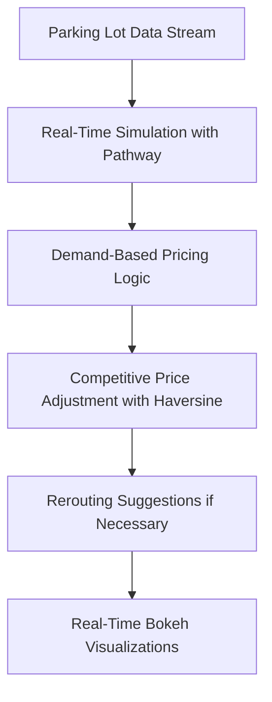

# Dynamic Pricing for Urban Parking Lots — Summer Analytics 2025 Capstone


---

<p align="center">
  <a href="https://drive.google.com/file/d/1K6SalYj7aJVol3XmZi9Q9H01lZnU53ko/view?usp=sharing">
    
  </a>
  <a href="https://github.com/KrDevanshu06/dynamic-parking-pricing-capstone/">
    
  </a>
</p>

---

## Overview

Urban parking is a growing challenge with congestion, limited space, and inefficient pricing. This project implements:

- Real-time **Dynamic Pricing Models** for parking lots
- Data-driven demand-based and competitive price adjustments
- Intelligent **Rerouting Suggestions** when lots are full or overpriced
- Real-time, interactive visualizations with **Bokeh**
- Compliant with strict technical constraints (Python, Pandas, Numpy, Pathway only)

---

## 🛠️ Tech Stack

| 🧩 Technology | 🎯 Purpose                              |
| ------------- | --------------------------------------- |
| 🐍 Python     | Core project logic                      |
| 📦 Pandas     | Data processing and feature engineering |
| ➗ Numpy       | Manual Haversine distance calculations  |
| 🔄 Pathway    | Real-time stream simulation             |
| 📊 Bokeh      | Interactive visualizations              |

---

## 🏗️ System Architecture

<!-- Generated with [Mermaid Live Editor](https://mermaid-js.github.io/mermaid-live-editor)-->



**Workflow Summary:**

* Real-time parking data enters via a simulated stream
* Prices adjust based on demand, occupancy, and traffic
* Competitor pricing and proximity assessed with Numpy Haversine
* If lots are full or overpriced, rerouting suggestions provided
* Price trends visualized live using Bokeh

---

## Features

Three pricing models:

* Baseline Linear Pricing
* Demand-Based Dynamic Pricing
* Competitive Pricing with Rerouting

✅ Numpy-only distance calculations for strict compliance<br/>
✅ Smooth, bounded price variations (0.5x to 2x base price)<br/>
✅ Real-time interactive Bokeh visualizations<br/>
✅ Safe handling of unknown vehicle types and traffic conditions<br/>
✅ Fully aligned with Summer Analytics Capstone constraints

---

## 📂 Repository Structure

```
dynamic-parking-pricing-capstone/
│
├── README.md              # Project documentation (this file)
├── architecture.png       # Exported architecture diagram (Mermaid-generated)
├── Dynamic_Pricing_Hackathon_Submission.ipynb         # Final, error-free simulation notebook
├── dataset.csv            # Sample dataset for testing
├── report.pdf (optional)  # Formal project report (optional)
└── requirements.txt       # Required Python packages
```

---

## 🖥️ Quick Start

1. **Clone the Repository**

```bash
[git clone https://github.com/yourusername/dynamic-parking-pricing-capstone.git
cd dynamic-parking-pricing-capstone](https://github.com/kunalSingh026/Dynamic_Pricing_Hackathon_Submission.git)
```

2. **Install Dependencies**

```bash
pip install -r requirements.txt
```

3. **Launch Notebook**

* Open `notebook.ipynb` in Jupyter or Colab
* Run all cells sequentially to view:
  ✅ Real-time price simulation
  ✅ Interactive visualizations
  ✅ Rerouting recommendations

---

## 📂 Dataset Details

`dataset.csv` contains simulated parking lot data with:

* Lot identifiers and GPS coordinates
* Capacity, occupancy, vehicle types
* Traffic conditions and timestamps

*For large datasets, a representative sample is provided for testing.*

---

## 📝 Additional Notes

* Manual Haversine implemented using `numpy` only (external packages avoided)
* Real-time behavior simulated with streaming logic and `time.sleep()`
* Fully tested, hackathon-compliant, and optimized for performance

---

## 📢 License

Licensed under the [MIT License](LICENSE).

---

## 🙌 Acknowledgements

* Developed as part of the **Summer Analytics 2025 Capstone Project**
* Special thanks to [Pathway](https://pathway.com) for real-time streaming tools


<p align="center">
  🚗 Parking made smarter. Data-driven. Real-time. Efficient.  
</p>
